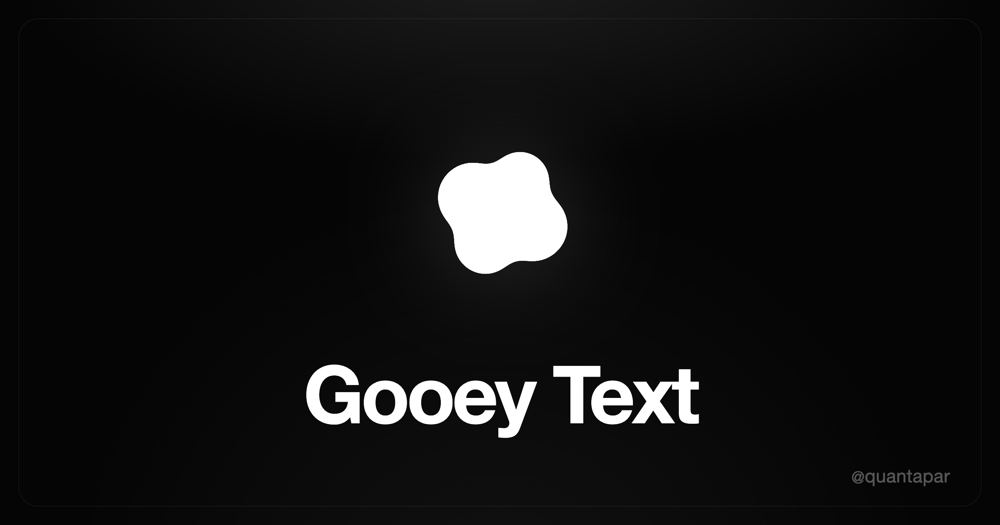

<div align="center">



# Gooey Text

**Type any letter and watch it melt into a gooey blob.**
A keyboard-driven morph effect built with SVG filters and Framer Motion.

### [▶ Live demo](https://gooey-text.quantapar.com)

</div>

---

## What is this?

Press a key and a cluster of circles flows along that letter's skeleton while an
SVG filter fuses them into one liquid shape. Every keystroke melts one glyph into
the next — lowercase, capitals, the whole alphabet. On touch devices, `‹ ›`
arrows and a caps toggle stand in for the keyboard.

At its core it's one dependency-light React component, `<GooeyText>`, plus a tiny
hook — drop it into any project.

## How it works

The "goo" is two SVG filter primitives working together:

1. **`feGaussianBlur`** blurs a handful of solid circles so their soft edges bleed into one another.
2. **`feColorMatrix`** drives the alpha contrast back up, so that blur snaps into a single crisp, fused shape — the gooey look.

Then, for each letter, the component:

- parses a **single-line SVG font** into one open stroke path,
- samples N points evenly along that path,
- animates the circles to those points with **Framer Motion**, staggered into a wave.

Change the character → the circles flow to the new path → it melts from one glyph
into the next.

## Run locally

Built with [Bun](https://bun.com) (bundler, dev server, and runtime — no Vite/Webpack).

```bash
bun install
bun dev          # → http://localhost:3000
```

```bash
bun run build    # static build → dist/
```

## Use the component

`<GooeyText>` is self-contained, so you can drop it anywhere:

```tsx
import { GooeyText, useGooeyKeyboard } from "./src/gooey-text";

export function Demo() {
  const { char, caps } = useGooeyKeyboard(); // tracks the last letter typed
  return <GooeyText char={char} radius={caps ? 19 : 17} />;
}
```

It's headless about its data — drive `char` from the keyboard, buttons, or any
source. Full props and the `useGooeyKeyboard` API are documented in
[`src/gooey-text/README.md`](src/gooey-text/README.md).

## Tech

- **React 19** + **Framer Motion** — per-blob animation
- **SVG filters** (`feGaussianBlur` + `feColorMatrix`) — the goo
- **Tailwind CSS v4** + **Bun** — styling, bundling, dev server

## Credits

The gooey-morph technique comes from Olivier Larose's excellent tutorial,
**[Text Gooey Morph](https://blog.olivierlarose.com/tutorials/text-gooey)**. This
project generalizes it to the full alphabet and adds keyboard + mobile controls.

Built by [**@quantapar**](https://x.com/quantapar).
